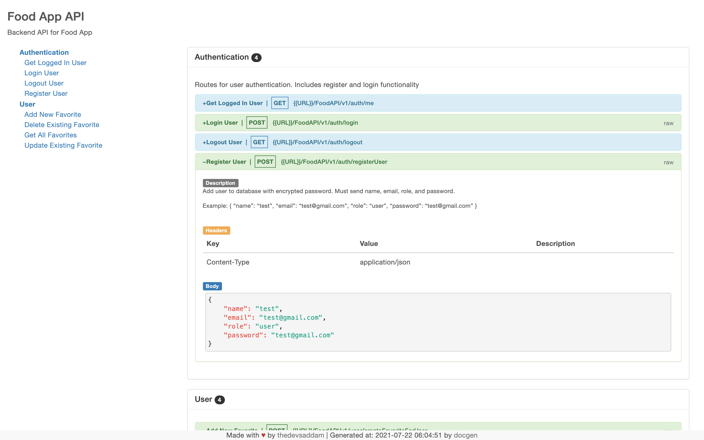

# Food App API

Backend API for Food App


## Indices

-   [Authentication](#authentication)

    -   [Get Logged In User](#1-get-logged-in-user)
    -   [Login User](#2-login-user)
    -   [Logout User](#3-logout-user)
    -   [Register User](#4-register-user)

-   [User](#user)

    -   [Add New Favorite](#1-add-new-favorite)
    -   [Delete Existing Favorite](#2-delete-existing-favorite)
    -   [Get All Favorites](#3-get-all-favorites)
    -   [Update Existing Favorite](#4-update-existing-favorite)

---

## Authentication

Routes for user authentication. Includes register and login functionality

### 1. Get Logged In User

Get information about current logged in user. Must be authenticated.

**_Endpoint:_**

```bash
Method: GET
Type:
URL: {{URL}}/FoodAPI/v1/auth/me
```

**_Headers:_**

| Key          | Value            | Description |
| ------------ | ---------------- | ----------- |
| Content-Type | application/json |             |

### 2. Login User

Login user with username and password.

Example:
{
"email": "test@gmail.com",
"password": "test@gmail.com"
}

**_Endpoint:_**

```bash
Method: POST
Type: RAW
URL: {{URL}}/FoodAPI/v1/auth/login
```

**_Headers:_**

| Key          | Value            | Description |
| ------------ | ---------------- | ----------- |
| Content-Type | application/json |             |
|              |                  |             |

**_Body:_**

```js
{
    "email": "test@gmail.com",
    "password": "test@gmail.com"
}
```

### 3. Logout User

Log out current user and clear cookie.

**_Endpoint:_**

```bash
Method: GET
Type:
URL: {{URL}}/FoodAPI/v1/auth/logout
```

**_Headers:_**

| Key          | Value            | Description |
| ------------ | ---------------- | ----------- |
| Content-Type | application/json |             |

### 4. Register User

Add user to database with encrypted password. Must send name, email, role, and password.

Example:
{
"name": "test",
"email": "test@gmail.com",
"role": "user",
"password": "test@gmail.com"
}

**_Endpoint:_**

```bash
Method: POST
Type: RAW
URL: {{URL}}/FoodAPI/v1/auth/registerUser
```

**_Headers:_**

| Key          | Value            | Description |
| ------------ | ---------------- | ----------- |
| Content-Type | application/json |             |

**_Body:_**

```js
{
    "name": "test",
    "email": "test@gmail.com",
    "role": "user",
    "password": "test@gmail.com"
}
```

## User

### 1. Add New Favorite

Create a new favorite for the logged in user. Send user_id (Mongo objectId) and text. Must be authenticated.

Example:
{
"user_id": "60f810f920713747139fd6ff",
"text": "Fast food"
}

**_Endpoint:_**

```bash
Method: POST
Type: RAW
URL: {{URL}}/FoodAPI/v1/user/createFavoriteForUser
```

**_Headers:_**

| Key          | Value            | Description |
| ------------ | ---------------- | ----------- |
| Content-Type | application/json |             |

**_Body:_**

```js
{
    "user_id": "60f958e0a9c5eb64c3c05029",
    "text": "fast food"
}
```

### 2. Delete Existing Favorite

Delete a favorite for a user using userID and favID. Must be authenticated.

Example:
{
"user_id": "60f810f920713747139fd6ff",
"fav_id": "60f9158ea74459555ab1689e"
}

**_Endpoint:_**

```bash
Method: DELETE
Type: RAW
URL: {{URL}}/FoodAPI/v1/user/deleteFavoriteForUser
```

**_Headers:_**

| Key          | Value            | Description |
| ------------ | ---------------- | ----------- |
| Content-Type | application/json |             |

**_Body:_**

```js
{
    "user_id": "60f958e0a9c5eb64c3c05029",
    "fav_id": "60f95905a9c5eb64c3c05032"

}
```

### 3. Get All Favorites

Get all favorites for a user using user email address. Must be authenticated.

Example:
{
"email": "test3@gmail.com"
}

**_Endpoint:_**

```bash
Method: GET
Type: RAW
URL: {{URL}}/FoodAPI/v1/user/getAllFavorites
```

**_Headers:_**

| Key          | Value            | Description |
| ------------ | ---------------- | ----------- |
| Content-Type | application/json |             |

**_Body:_**

```js
{
    "email": "test3@gmail.com"
}
```

### 4. Update Existing Favorite

Update existing favorite for user using userID, favID, and text. Must be authenticated.

Example:
{  
 "user_id": "60f810f920713747139fd6ff",
"fav_id": "60f916dab7e1d255c5270014",
"updatedFavorite": "Sushi"
}

**_Endpoint:_**

```bash
Method: PUT
Type: RAW
URL: {{URL}}/FoodAPI/v1/user/updateFavoriteForUser
```

**_Headers:_**

| Key          | Value            | Description |
| ------------ | ---------------- | ----------- |
| Content-Type | application/json |             |

**_Body:_**

```js
{
    "user_id": "60f958e0a9c5eb64c3c05029",
    "fav_id": "60f95901a9c5eb64c3c0502f",
    "updatedFavorite": "Sushi"
}
```

---

[Back to top](#food-app-api)

> Made with &#9829; by [thedevsaddam](https://github.com/thedevsaddam) | Generated at: 2021-07-22 06:05:54 by [docgen](https://github.com/thedevsaddam/docgen)
